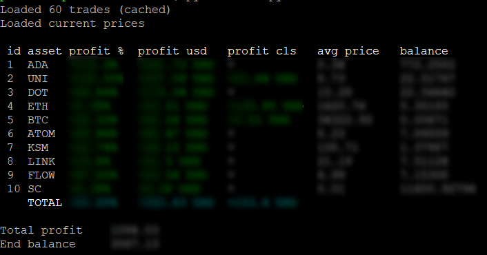

## Warning

 - This tool is not very accurate, f.eg. it does not consider fees in calculations (work in progress)
 - It does not provide any professional capacity, do *not* use it for calculating taxes!
 - This tool only supports USD/EUR as a buying currency (work in progress)
 - Conversion from EUR to USD is not very accurate either (work in progress)
 - It does not work for positions, only buy/sell trades

## Features

 - Automatically downloads trade history from your Kraken account
 - Calculating open and closed profits/losses
 - Displaying them as percentages or USD amounts

## Usage

 - Download code
 - Generate API Key and Private Key by going to kraken.com -> your name -> Security -> API -> Add key. We only need one permission: `Query Ledger Entries`
 - Create `keys.json` file with just generated API Key and Private Key:  
 	`{ "api_key": "INSERT_API_KEY_HERE", "private_key": "INSERT_PRIV_KEY_HERE"}`
 - Run script with command `python run.py` or `python run.py help`